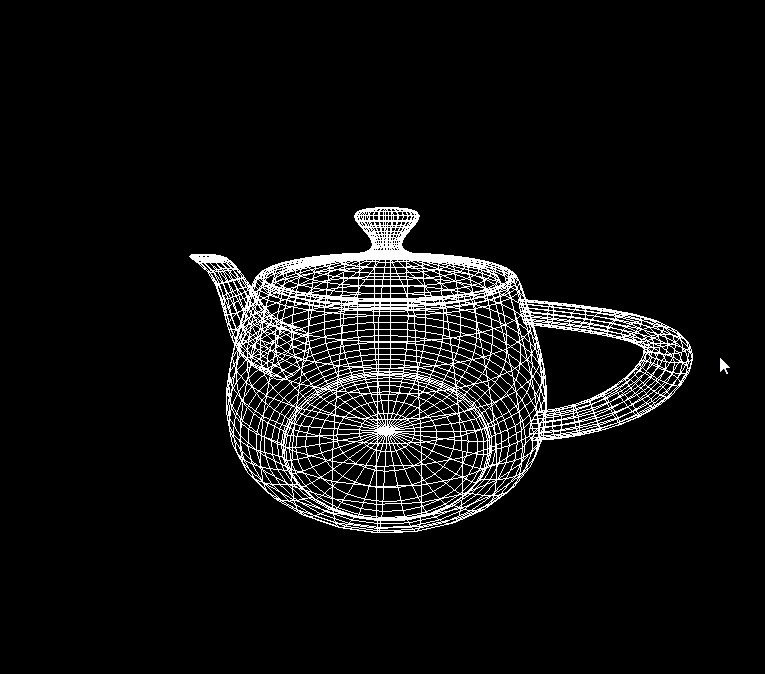

## 01 绘制茶壶模型

### 概述
基于glut框架实现的简单茶壶3D图形

### 内容
- 按住鼠标左键拖移可以调节视角方向
- 使用鼠标滚轮或者[w,s]键可以调节镜头距离

### 演示

## 02 绘制太阳系模型

### 概述
基于glut框架实现太阳系的简易运转模型

### 内容
- 实现将太阳作为图形光源
- 实现对太阳、地球、月亮表面图案的纹理映射

### 演示

