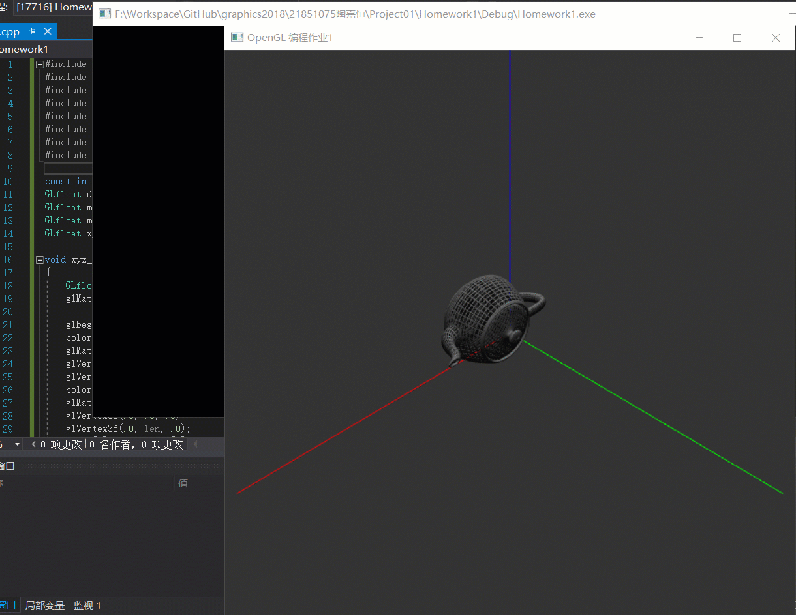

# 编程作业1：OpenGL基本程序

本次作业包括三部分：
- 使用glfw和glew（也可以使用glut或者Qt等其他框架）搭建OpenGL基本框架
- 实现基本模型绘制
- 实现相机控制

我的作业环境：
- Windows 10
- OpenGL 4.5
- freeglut 2.8.1

## IDE及OpenGL等框架配置

IDE使用的Visual Studio 2017，配置参考
- [OpenGL 开发环境配置（Windows）- Visual Studio 2017 + GLFW + GLAD](https://blog.csdn.net/sigmarising/article/details/80470054)
- [GLEW、freeglut配置](http://lemonc.me/opengl-win10-vs2015-setting.html)
其中freeglut.dll、glew32.dll放在`C:\Windows\SysWOW64`下。TIPS：`C:\Windows\System32`文件夹作为 64 位 DLL 的文件夹，而不是存放 32 位 DLL 文件的文件夹。
- [LearnOpenGL-CN](https://learnopengl-cn.github.io/)

## 作业成果

[代码](Homework1/Homework1/main.cpp)

