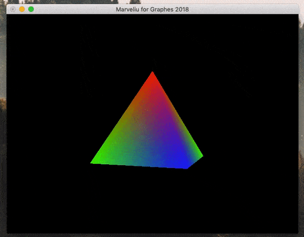
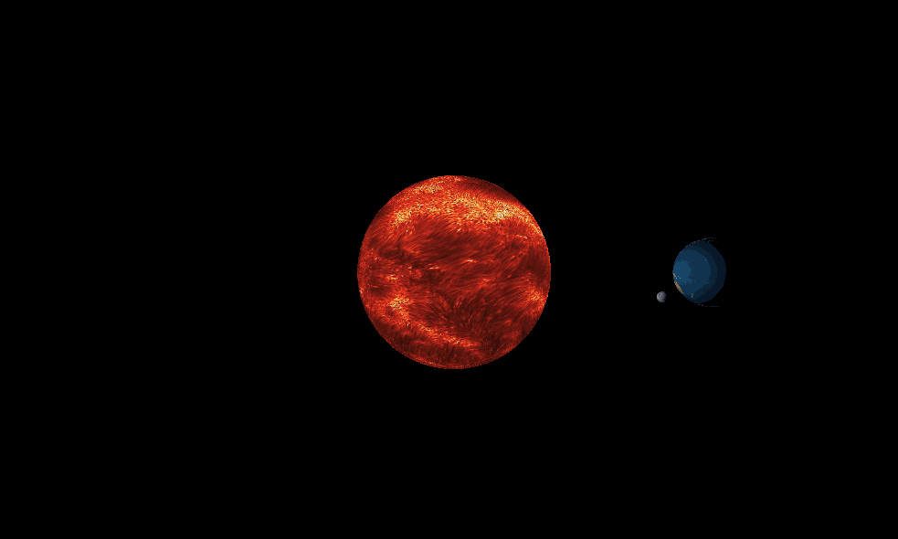

Marveliu's Homework
====

# homework1
基于 Glut 框架实现一个金字塔模型，支持模型的旋转以及观察视角的上下左右前后移动。
## 操作说明
 `w`：上移，`s`：下移， `a`：左移，`d`：右移， `f`： 前移，`b`：后移。
## 演示

#homework2
基于glut框架实现太阳系的简易运转模型，实现将太阳作为光源，对太阳、地球、月亮表面图案的纹理映射。

