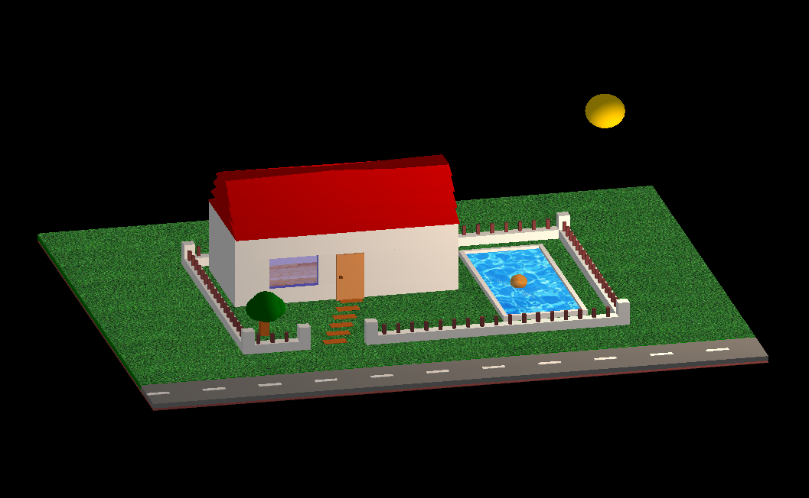
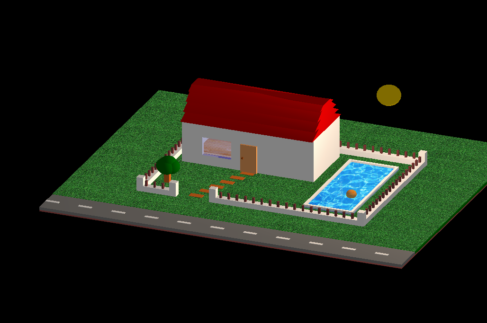

# 作业三

本次作业我参考了*《OpenGL 房子》*

## 操作说明

1.	该程序在Visual Studio + OpenGL的平台上模拟了一个三维立体场景中的庭院，场景中包括草地、树木、房屋、泳池、小球、栅栏、小路、马路和太阳等对象。

2.	场景观测视角旋转：键盘↑/↓/←/→分别对应控制视角上移、下移、左移和右移。

3.	场景缩放：键盘F7/F8分别对应控制场景放大和缩小。

4.	小球运动：泳池中小球会随着水波自动沉浮，并且可以通过键盘F1/F2/F3/F4分别控制小球向前、向后、向左、向右游动

